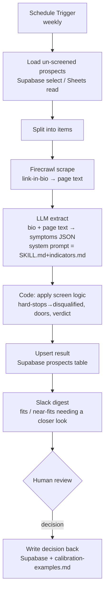

# n8n Workflow Design — Berry Nova Prospect Screener

Goal: run the prospect **screen** hands-off. Agents/n8n do the work; Phil steers
by maintaining the skill (the brain) and reviewing flagged prospects. No laptop,
no Chrome-on-9222, no PowerShell.

**The key finding:** your n8n already has **`Firecrawl BerryNova`** credentialed.
Firecrawl is a hosted render-and-scrape API that gets past the Linktree/Stan
bot-blocks that beat the local reader. So the browser step becomes a hosted API
call — the whole thing runs in n8n on a schedule.

## The brain is the repo skill

The workflow does not re-invent judgment. `SKILL.md` + `indicators.md` +
`doors.md` become the **LLM system prompt** for the extraction/screen node.
Maintaining the skill in git = maintaining the workflow's screen. That is the
"you steer the skill, agents run it" split.

## Architecture

## Nodes (grounded in your actual n8n)

Target project: **BerryNova** team (`cjX8d5pgL5PahDdR`). Credentials that already
exist are named below.

1. **Schedule Trigger** (`n8n-nodes-base.scheduleTrigger`) — weekly (or a Form
   Trigger for on-demand runs).
2. **Load prospects** — `Google Sheets · read` (cred `user@example.com -
   googleSheetsOAuth2Api`) from the raw-prospects sheet, **or** Supabase select
   of rows where `screened_at is null`. Recommend Supabase as the store,
   Sheets/CSV only as an import path.
3. **Split Out** — one item per prospect.
4. **Firecrawl scrape** (`@mendable/n8n-nodes-firecrawl.firecrawl`, resource
   Scraping / op `scrape`; cred `Firecrawl BerryNova` = `SWCB5NyKsCIYJAJM`) —
   fetch each prospect's primary `ext_url`, return clean markdown/text. This is
   the 9222 replacement. Firecrawl also has an `extract` op that can pull
   structured data with a schema — an option to fold steps 4+5 into one.
5. **LLM extract** — `OpenAI` (cred `OpenAI BerryNova` = `izNRG0eSGUQXNZXD`) or
   `Anthropic` node (needs an Anthropic API credential — not present yet;
   recommend adding one to run Claude, for parity with the skill). System prompt
   = the skill files. Output = strict JSON: `{offer_type, fired_symptoms[],
   door, screen, missing[], closer_look, evidence}`.
6. **Code — apply screen logic** (`n8n-nodes-base.code`, no network needed):
   deterministically compute the final `screen` + `door` from the fired
   symptoms per `indicators.md` (any hard-stop → disqualified; vehicle+method →
   fit; else near-fit + missing). Keeps the verdict auditable instead of trusting
   the LLM wholesale.
7. **Upsert result** — Supabase (`Supabase BerryNova` = `ijkq6ICLcKv8Fiyi`) or
   Sheets `appendOrUpdate` (dedup by `username`).
8. **Slack digest** — `Slack · message post` (cred `Slack BerryNova` =
   `kHGFK2xQZL4ZgDt6`): per-run summary — counts by screen/door + the list of
   `closer_look` prospects with profile + link. Optionally `Slack sendAndWait` /
   HITL for inline approve/skip.
9. **Feedback** — human decisions land in Supabase; a periodic step (or a small
   second workflow) folds confirmed calls into `calibration-examples.md` to
   sharpen the screen.

## Data model (Supabase `prospects`)

`username` (pk) · `full_name` · `bio` · `link_url` · `link_text` · `offer_type`
· `fired_symptoms` (jsonb) · `screen` · `door` · `missing` (jsonb) ·
`closer_look` (bool) · `scraped_at` · `reviewed` (bool) · `decision` ·
`decided_by` · `decided_at`.

## Phasing

- **Phase 0 — Harvest (upstream, separate):** where do raw prospect rows come
  from? Options: an Apify Instagram scraper (there's an Apify MCP node) or
  Firecrawl search, feeding the raw sheet/table. This is its own workflow; the
  screener assumes rows exist.
- **Phase 1 — Screener (this doc):** load → Firecrawl → LLM extract → screen →
  store → Slack digest. The core hands-off loop.
- **Phase 2 — Feedback:** human decisions → calibration set → sharper screen.

## Steering decisions needed before build

1. **Link reading = Firecrawl?** (Recommended — already credentialed, hosted,
   defeats bot-blocks. Confirms the no-laptop model.)
2. **LLM = OpenAI (credentialed now) or add an Anthropic key for Claude?**
   (Recommend Claude for parity with the skill; needs a credential added.)
3. **Store = Supabase** (structured, dedup, state) **or Google Sheet** (simpler,
   visible)? (Recommend Supabase + a Slack/Sheet view for humans.)
4. **Review surface** — which **Slack channel** for the digest, and do you want
   inline approve/skip (HITL) or just a list?
5. **Cadence** — weekly? and roughly how many prospects per run (Firecrawl +
   LLM cost scales with volume)?
6. **Phase 0 harvest** — is there an existing scraper feeding rows, or should we
   design that too?

## What I can do once you steer

I can author and deploy this workflow into your BerryNova n8n project via the n8n
MCP (I'll follow the SDK flow: reference → node types → build → validate) once
decisions 1-5 are set. Phase 0 harvest can be a follow-up workflow.
